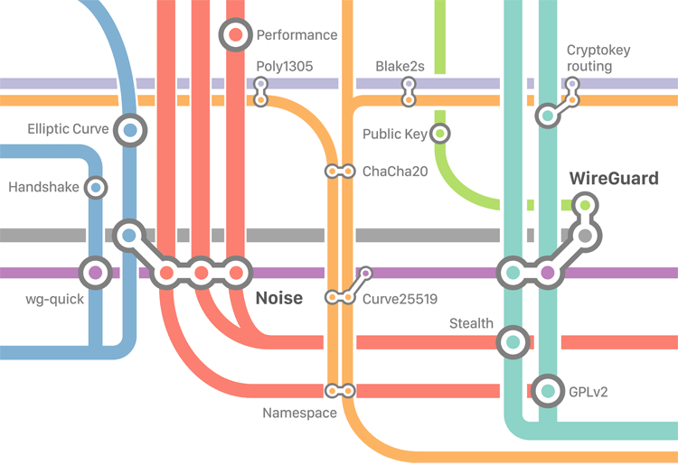

# WireGuard im Einsatz (Buch)

VPN-Tunnel sind &uuml;berall. Sie verlaufen zwischen Firmenstandorten, erm&ouml;glichen Fernzugriff auf den heimischen DSL-Router und die meisten Laptops haben einen VPN-Client vorinstalliert.

Die Grundlagen von VPN sind nicht neu: Der Klassiker IPsec entstand vor mehr als zwei Jahrzehnten und besch&uuml;tzt seitdem die Kommunikation seiner Teilnehmer.

__Erhältlich seit Februar 2023 als E-Book und gedrucktes Buch. Die vierte Auflage erscheint im Juni 2025.__

Ein Blick ins [Inhaltsverzeichnis](Inhaltsverzeichnis.md).

## Schnell, modern, sicher: VPN

WireGuard ist ein neuer Spieler im VPN-Stadion und will schnell, einfach, modern und sicher sein. Wie erreicht WireGuard diesen hohen Anspruch?

__WireGuard im Einsatz__ beginnt ohne Vorkenntnisse und installiert die Software unter Windows, Linux und auf Smartphones. Anschlie&szlig;end entstehen die ersten VPN-Tunnel und das Cryptokey-Routing beginnt.

Die praktischen Beispiele im Buch zeigen WireGuard im Einsatz auf Firewalls, Routern und in vielen Szenarien mit IPv4, IPv6, Adressumsetzung, Paketfiltern, Pre-shared Keys und unter hoher Last.

Dieses Buch m&ouml;chte dem Leser den Einstieg erleichtern, die Unterschiede zu anderen VPN-Techniken beschreiben und praktisches Wissen vermitteln. Die Kapitel fokussieren auf den t&auml;glichen Einsatz und erkl&auml;ren kurz die verwendete Kryptografie. Denn WireGuard ist ein zuverl&auml;ssiger Begleiter, auch wenn elliptische Kurven und ChaCha20 Fremdw&ouml;rter sind.

## Ressourcen

* Was ist drin im Buch? Ein Blick ins [Inhaltsverzeichnis](Inhaltsverzeichnis.md) zeigt die behandelten Themen.

* Die [Konfiguration](Kapitel/) der WireGuard-Rechner aller Kapitel zum Nachbauen oder f&uuml;rs Verst&auml;ndnis. Dort liegen auch die verwendeten Skripte und Ergebnisse der Messungen.

* Das [Korrekturverzeichnis](errata.pdf) listet die inhaltlichen Fehler und ihre Verbesserung.

* Buch kaufen bei [Amazon](https://amzn.to/3Zb4Mx6) (Affiliate-Link) oder [BoD](https://buchshop.bod.de/wireguard-im-einsatz-markus-stubbig-9783757802424)

* Kontakt zum Autor per [E-Mail](mailto:wireguard.buch@gmail.com)

* Fehler melden. [E-Mail](mailto:wireguard.buch@gmail.com?subject=Fehler)

* [Stichwortverzeichnis](Stichwortverzeichnis.pdf)

* [Impressum](Impressum.md)
